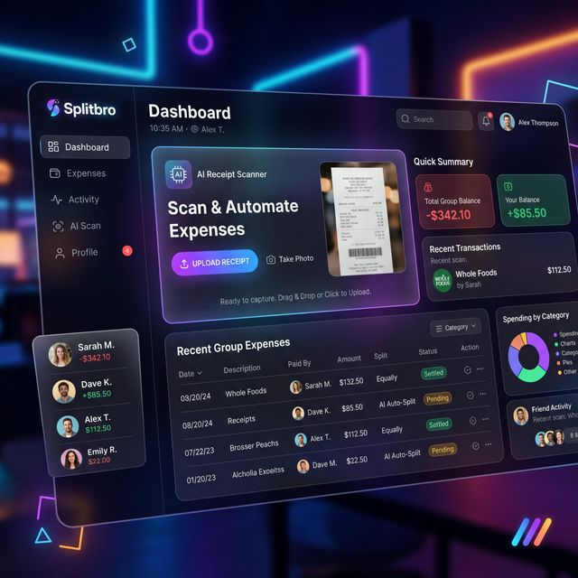

# Splitbro - Arkadaş Grupları Arası Harcama Bölüştürme Platformu



Splitbro, arkadaş gruplarınızla yaptığınız harcamaları kolayca takip etmenizi, fiş okuma özelliği sayesinde giderleri akıllıca bölüştürmenizi sağlayan Full-Stack bir web uygulamasıdır. 

## 🚀 Özellikler

- **AI Destekli Fiş Tarama:** Yüklediğiniz fiş görselleri yapay zeka tarafından okunarak otomatik gider kayıtlarına dönüştürülür ve sınır/fiyat anomalileri tespit edilir.
- **Akıllı Borç Hesaplama Algoritması:** Gruba eklenen tüm masraflardan sonra kimin kime ne kadar borçlu olduğu otomatik ve adil bir şekilde ("Kim Ödeyecek", "Kime Ödeyecek") hesaplanır.
- **Kapsamlı Grup ve Üye Yönetimi:** Grup kurma, üye ekleme/çıkarma, gruplara özel harcama açma işlemleri.
- **Yetkilendirme ve Güvenlik:** JSON Web Token (JWT) tabanlı şifreli erişim kontrolü, parola güvenliği.
- **Vercel Serverless Uyumu:** Backend mimarisi Serverless yapılandırmasıyla 7/24 kesintisiz çalışmaya uygun hale getirilmiştir.

## 🛠️ Teknoloji Yığını (Tech Stack)

**Frontend:** React 18, Tailwind CSS, Zustand (State Management), React Router, Axios  
**Backend:** Node.js, Express.js, Mongoose (MongoDB Profil/Embedded Documents), JWT  
**Altyapı:** Docker & Docker Compose (Lokal Geliştirme İçin)

## 📦 Kurulum ve Çalıştırma

### 1. Lokal Ortamda (Docker ile) Çalıştırma

Projeyi bilgisayarınıza klonladıktan sonra tek bir komutla ayağa kaldırabilirsiniz. (Backend, Frontend ve MongoDB iletişimleri Docker Compose ile otomatik bağlanacaktır.)

```bash
git clone https://github.com/cagataycndss/split.git
cd split
docker-compose up -d --build
```

- **Frontend (Arayüz):** http://localhost:3000
- **Backend API:** http://localhost:5000 

### 2. Vercel Üzerinde Bulutta Çalıştırma

Projeyi Vercel üzerinden sunmak için gerekli Serverless konfigürasyon (`vercel.json`) dosyaları hazır durumdadır. 

1. **MongoDB Atlas** üzerinden bulut veritabanı kopyalayın ve bağlayın.
2. Projenin `/backend` klasörünü Vercel'e ekleyin. `MONGODB_URI` değerini Environment olarak atayın.
3. `/frontend` klasörünü Vercel'e ekleyip, `REACT_APP_API_URL` ortam değişkenine az önce kurduğunuz API'nin adresini (Örn: `https://splitbro-api.vercel.app`) yazın.

## 🤝 Takım & Mimari Prensip

Projedeki roller, gereksinim analizi dokümanına uygun olarak üç farklı ismin (Çağatay Candaş, Furkan Kasalak ve Gökdeniz Erten) API metotları ve sorumluluk alanlarına ayrıştırılarak inşa edilmiştir. Doküman tasarım prensiplerine göre Expenses (Giderler) nesnesinin içerisi, ürün satırlarını `embedded` (gömülü) olarak barındırır ve gereksiz referans (ref) kullanımından kaçınılarak modern MongoDB standartları sağlanır.
